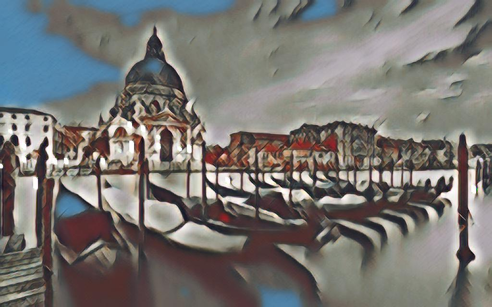
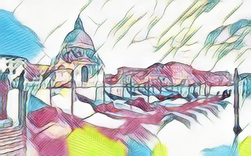
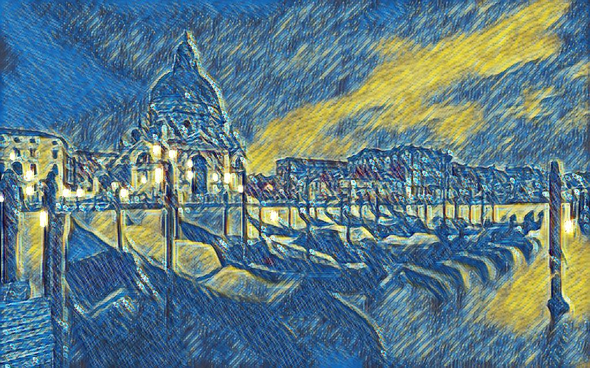
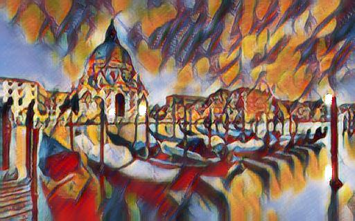
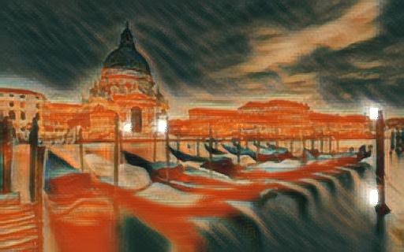
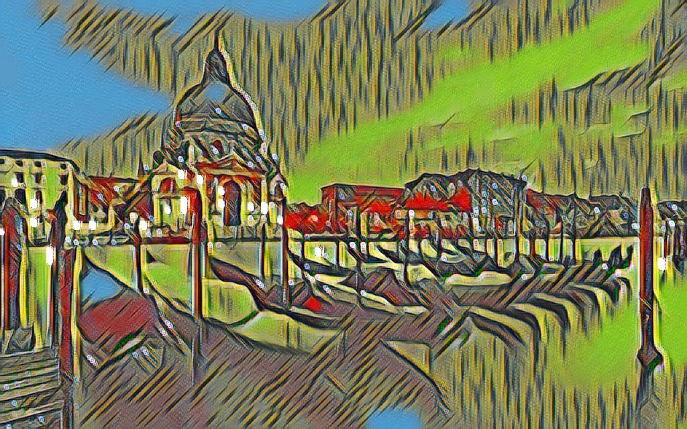
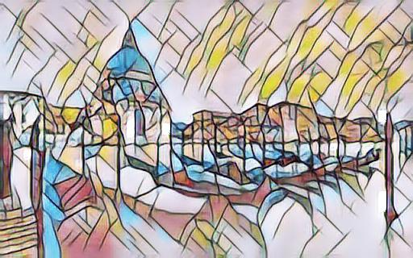
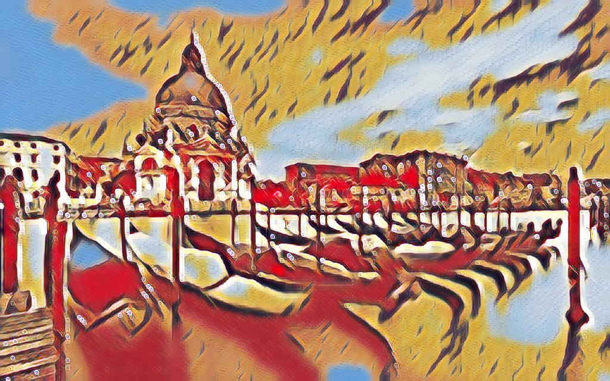
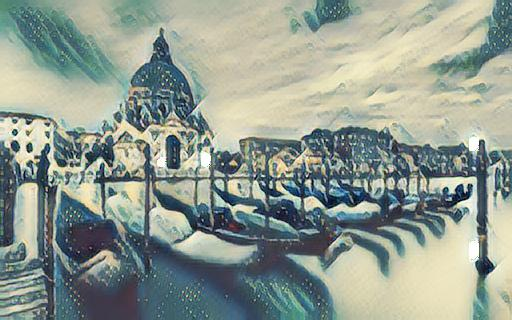

<table width="100%" border="0" cellspacing="15" cellpadding="0">
	<tbody>
		<tr>
			<td>
			<b>Multi-style Generative Network for Real-time Transfer</b>  [<a href="https://arxiv.org/pdf/1703.06953.pdf">arXiv</a>] [<a href="http://computervisionrutgers.github.io/MSG-Net/">project</a>]  <br>
  <a href="http://hangzh.com/">Hang Zhang</a>,  <a href="http://eceweb1.rutgers.edu/vision/dana.html">Kristin Dana</a>
<pre>
@article{zhang2017multistyle,
	title={Multi-style Generative Network for Real-time Transfer},
	author={Zhang, Hang and Dana, Kristin},
	journal={arXiv preprint arXiv:1703.06953},
	year={2017}
}
</pre>
			</td>
			<td width="440"><a></a></td>
		</tr>
	</tbody>
</table>

# PyTorch-Style-Transfer

Please install [PyTorch](http://pytorch.org/) with cuda and cudnn support. The code has been tested on Ubuntu 16.04 with Titan X Pascal and Maxwell.
If you would like to produce exactly the same result as in the paper, please visit our original [Torch implementation](https://github.com/zhanghang1989/MSG-Net/).

### Test Pre-trained Model
0. Download the pre-trained model
	```bash
	git clone git@github.com:zhanghang1989/PyTorch-Style-Transfer.git
	cd PyTorch-Style-Transfer/experiments
	bash models/download_model.sh
	```
0. Test the model
	```bash
	python main.py eval --content-image images/content/venice-boat.jpg --style-image images/9styles/candy.jpg --model models/9styles.model
	```
* `--content-image`: path to content image you want to stylize.
* `--style-image`: path to style image (typically covered during the training).
* `--model`: path to the pre-trained model to be used for stylizing the image.
* `--output-image`: path for saving the output image.
* `--content-size`: the content image size to test on.
* `--cuda`: set it to 1 for running on GPU, 0 for CPU.

 








### Train Your Own Model
0. Download the dataset
	```bash
	bash dataset/download_dataset.sh
	```
0. Train the model
	```bash
	python main.py train --epochs 2
	```
* `--style-folder`: path to the folder style images.
* `--vgg-model-dir`: path to folder where the vgg model will be downloaded.
* `--save-model-dir`: path to folder where trained model will be saved.
* `--cuda`: set it to 1 for running on GPU, 0 for CPU.


### Acknowledgement
The code benefits from outstanding prior work and their implementations including:
- [Texture Networks: Feed-forward Synthesis of Textures and Stylized Images](https://arxiv.org/pdf/1603.03417.pdf) by Ulyanov *et al. ICML 2016*. ([code](https://github.com/DmitryUlyanov/texture_nets))
- [Perceptual Losses for Real-Time Style Transfer and Super-Resolution](https://arxiv.org/pdf/1603.08155.pdf) by Johnson *et al. ECCV 2016* ([code](https://github.com/jcjohnson/fast-neural-style)) and its pytorch implementation [code](https://github.com/alexis-jacq/Pytorch-Tutorials) by Alexis.
- [Image Style Transfer Using Convolutional Neural Networks](http://www.cv-foundation.org/openaccess/content_cvpr_2016/papers/Gatys_Image_Style_Transfer_CVPR_2016_paper.pdf) by Gatys *et al. CVPR 2016* and its torch implementation [code](https://github.com/jcjohnson/neural-style) by Johnson.
